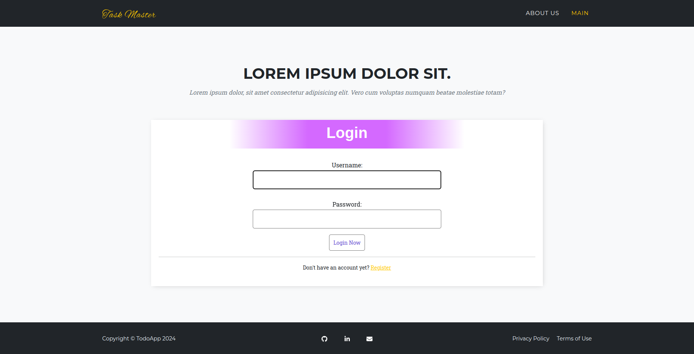
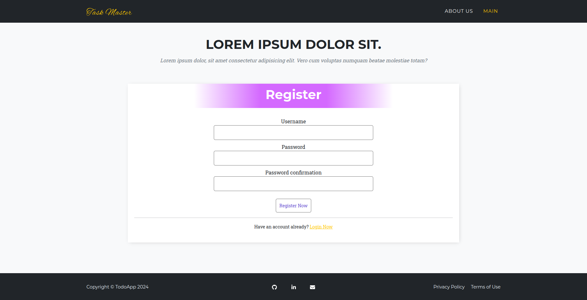
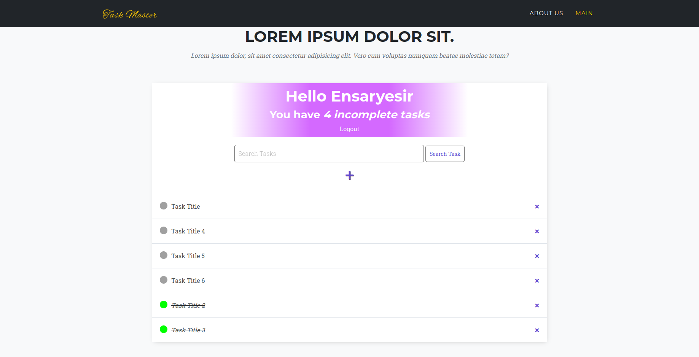

# Project Installation Guide

This guide provides step-by-step instructions for setting up the Todo-App project. It covers information about the required software and configurations for the project.

## Step 1: Prerequisites

Before starting the project installation, you need the following prerequisites:

- [Python](https://www.python.org/) (version 3.7 or higher)
- [PostgreSQL](https://www.postgresql.org/) (database server)
- [pip](https://pip.pypa.io/en/stable/installing/) (Python package manager)

## Step 2: Download Project Code

You can download the project code from this [https://github.com/ensaryesir/Todo-App].

git clone https://github.com/ensaryesir/Todo-App.git

## Step 3: Create a Virtual Environment

We recommend creating a virtual environment for the project. A virtual environment is used to isolate project-specific dependencies. Use the following commands to create a virtual environment:

```shell
# Create a virtual environment
python -m venv myenv 

# Activate the virtual environment (Linux)
source venv/bin/activate

# Activate the virtual environment (Windows)
venv\Scripts\activate
```

## Step 4: Install Required Packages

To install project dependencies, use the following command:

```shell
pip install -r requirements.txt
```

## Step 5: Set up PostgreSQL Database

- Install and start the PostgreSQL database.
- Create a user and database for the PostgreSQL database.

## Step 6: Configure Project Settings

Edit the project settings by opening the `settings.py` file and configure the PostgreSQL connection settings.

```python
DATABASES = {
    'default': {
        'ENGINE': 'django.db.backends.postgresql',
        'NAME': 'todoappDB',
        'USER': 'postgres',
        'PASSWORD': '6161',
        'HOST': 'localhost',
        'PORT': '5432', # Default port
    }
}
```

## Step 7: Create the Database with Migrations

```shell
python manage.py makemigrations
python manage.py migrate
```

## Step 8: Create a Superuser

To use the Django admin interface, create a superuser:

```shell
python manage.py createsuperuser
```

## Step 9: Start the Server

You can run the project with the following command:

```shell
python manage.py runserver
```

## Step 10: Access the Project

You can access the project application using your web browser at "http://localhost:8000".

This guide will help you successfully set up the Todo-App project. 
If you encounter any problems, you can contact me via my email address: yesirensar@gmail.com


## A Few Pictures From the Site



